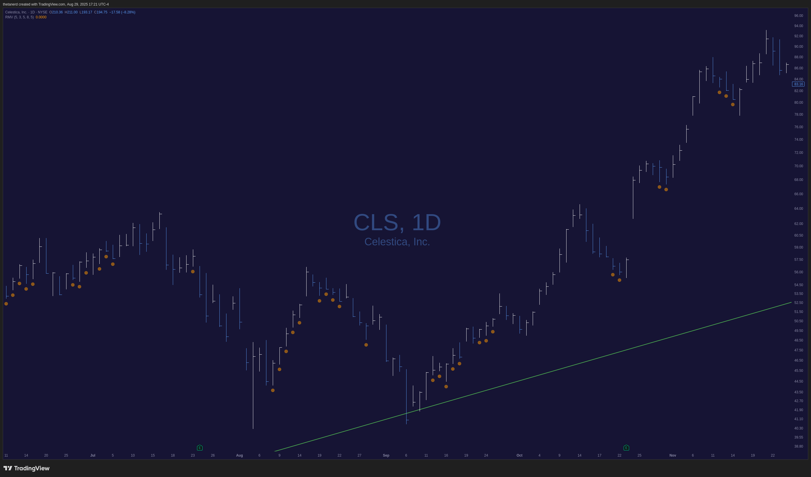

# Relative Measured Volatility (RMV) Indicator

This indicator helps you find low volatility periods for any stock or ETF.
When this indicator shows an orange circle below the price bar and volume is unusually low, it indicates a potential low volatility period that may precede a significant price move.
For more detail, check out this detailed blog post: https://tradingengineered.substack.com/p/how-i-use-relative-measured-volatility

