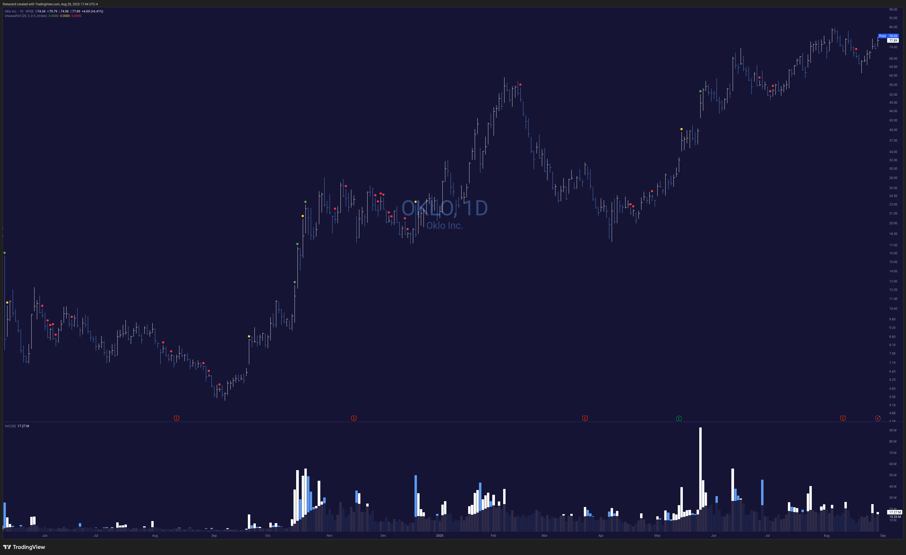

# Unusual Volume Markers

Find unusual volume with this indicator, including:

* Highest volumes ever (green circle)
* Volume greater than 3x the 20-day SMA (yellow circle)
* Low volume under 50% of the 20-day SMA (red circle)

All of these colors and measurements are configurable. Enjoy! 🤓

