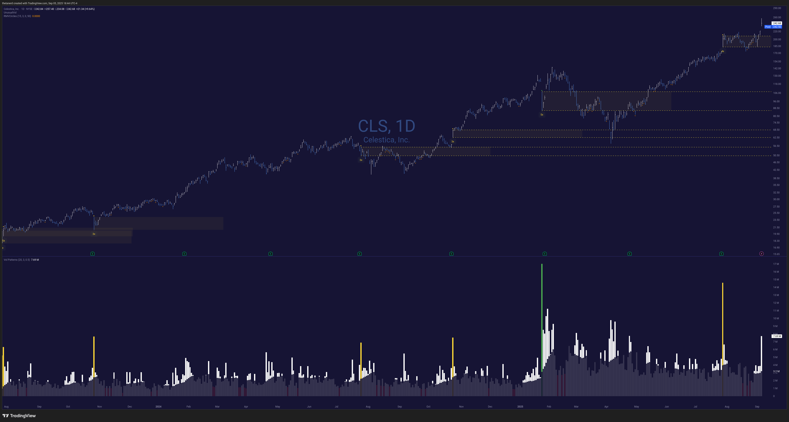

# Volume Historical

Much like the Unusual Volume indicator, this volume indicator highlights several things:

* 🟢 Highest volumes ever (green)
* 🟡 Volume greater than 3x the 20-day SMA (yellow)
* 🔴 Low volume under 50% of the 20-day SMA (red)
* ⚪ Regular volume bars (white with 25% opacity)
* 📊 Volume SMA displayed with subtle transparency (70% opacity)

All of these colors and measurements are configurable. Enjoy! 🤓

## ⏰ Time Filtering (Optional)

Filter volume to specific trading hours in NYC timezone! This feature works on both intraday and daily timeframes:

* **Enable Time Filter**: Toggle to activate hour-based filtering (default: OFF)
* **Start/End Time**: Configurable hour and minute settings (default: 10:00 AM - 3:30 PM NYC)
* **Show Time Filter Headband**: Display a visual reminder at the top of the indicator showing your active time filter (default: ON when filter is enabled)

### How It Works

* **Intraday charts** (1m, 5m, 15m, etc.): Only shows volume for bars within your specified time window
* **Daily charts**: Aggregates only the volume that traded during your specified hours each day using 5-minute bar data

Perfect for excluding pre-market and after-hours volume noise! 🎯

