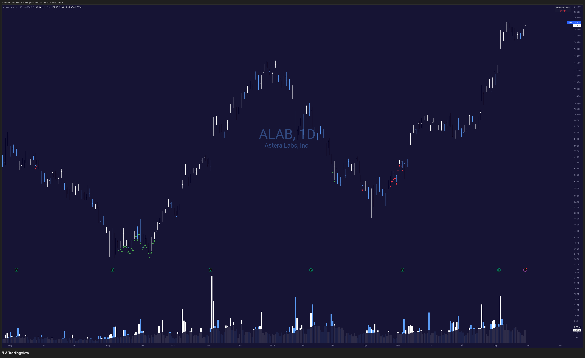

# Volume Trend

Find trends in the volume simple moving average (SMA).

* Adds arrows below candles when the volume SMA has been increasing for a specified number of days (default 10).
* Optionally enable an ATR-based MA to change the SMA for stocks with higher or lower volatility.

All of these colors and measurements are configurable. Enjoy! 🤓

